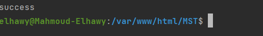
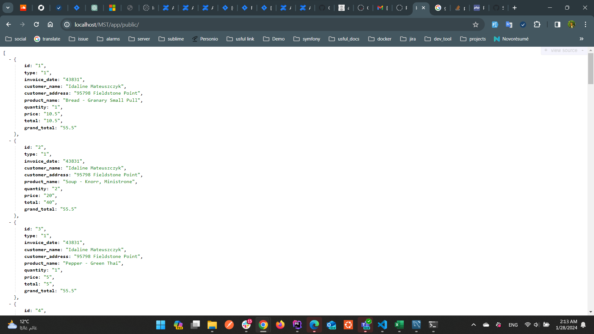

# MST
clone repository git clone  https://github.com/elhawy121994/MST.git

cd MST
`run composer install`
# Import Data From XLSX
`php app/public/import.php`

# Render Json Data
open the project from apache or xamp or any web server an go to this path `MST/public/index.php`
you should see this output
